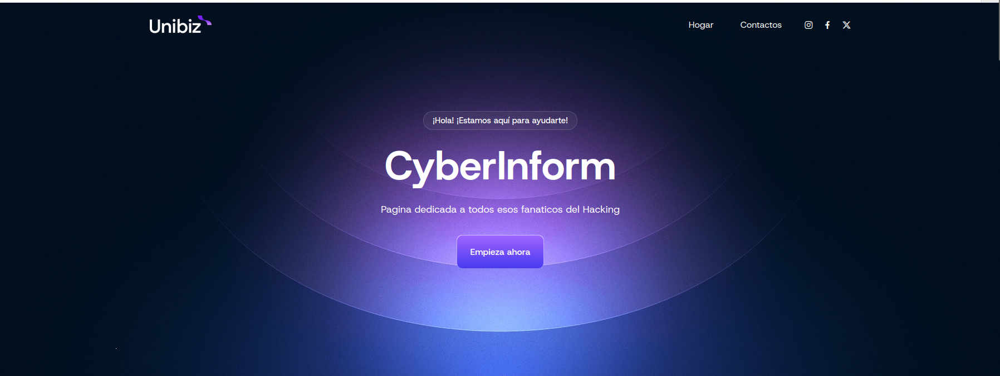
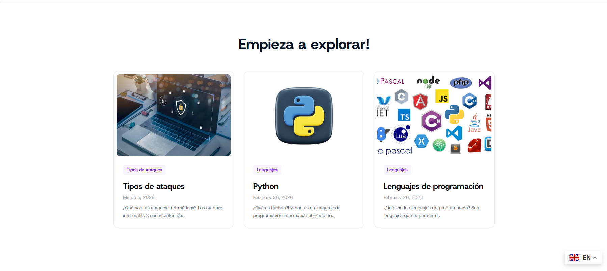
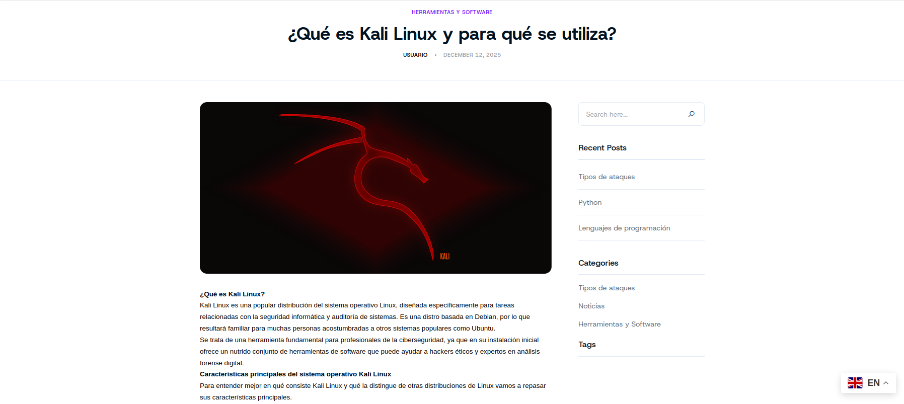
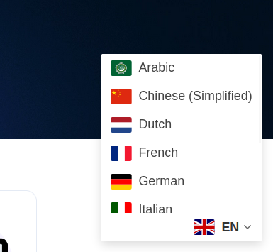
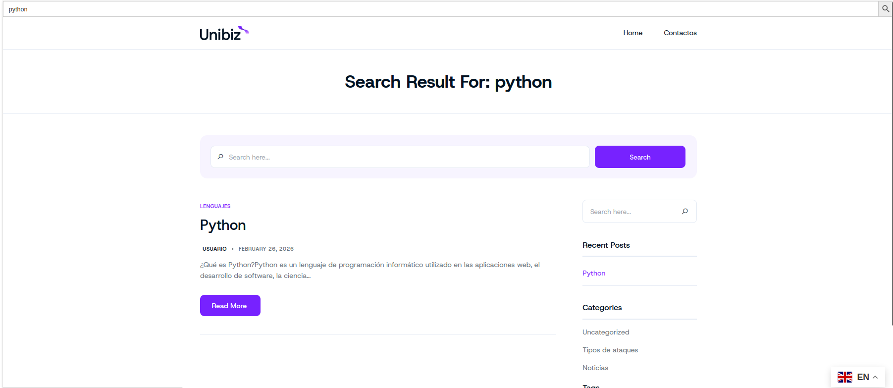

# Practica-Tema-3---Instalación-Configuración-de-WordPress

## Descripción del proyecto

Para realizar este proyecto he desarrollado una página web sobre **ciberseguridad** llamada **CyberInform**, utilizando **WordPress**.  
El objetivo principal era crear un sitio web informativo donde los usuarios puedan aprender conceptos básicos sobre seguridad informática, herramientas y tipos de ataques.

## Instalación y configuración

Primero instalé **LAMP** y posteriormente **WordPress** para poder crear la página web.  
Después elegí un tema visual adecuado y personalicé diferentes aspectos del diseño como los colores, el menú de navegación y la estructura de la página principal para que la información fuera clara y fácil de entender.

## Organización del contenido

Para organizar la información creé diferentes **categorías**, entre ellas:

- Lenguajes de programación  
- Herramientas y software  
- Tipos de ataques  
- Noticias

Estas categorías permiten clasificar las entradas del blog y facilitar la navegación a los usuarios.

## Configuración del sitio

Durante el desarrollo también configuré algunos elementos importantes del sitio web:

- Menú principal de navegación  
- Página de inicio  
- Publicación de entradas  
- Gestión del contenido desde el panel de WordPress

## Pruebas finales

Finalmente comprobé que la página funcionara correctamente en distintos dispositivos, asegurando que el diseño sea **responsive** y fácil de usar.

# Explicación del Portal

Esta página web está dedicada a la **ciberseguridad**, donde los usuarios pueden encontrar información básica sobre herramientas, lenguajes y conceptos importantes del mundo de la seguridad informática.

## Posts

En el apartado de **Posts** se publican diferentes artículos relacionados con la ciberseguridad, como explicaciones sobre herramientas o tipos de ataques.

## Herramientas y Software

En esta sección se muestran algunas herramientas importantes utilizadas en ciberseguridad como **Kali Linux**, además de explicaciones sobre su uso.

## Lenguajes de programación y demas

También hay contenido sobre **lenguajes de programación** como **Python**, **Malware**.. 

## Buscador y Traductor

La página incluye un **buscador** y un **traductor** para facilitar que cualquier usuario pueda encontrar la información y acceder al contenido en diferentes idiomas.

